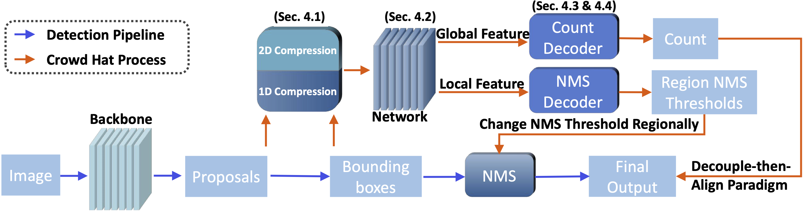

# Boosting Detection in Crowd Analysis via Underutilized Output Features

### [Project Page](https://fredfyyang.github.io/Crowd-Hat/) |   [Paper](https://openaccess.thecvf.com/content/CVPR2023/papers/Wu_Boosting_Detection_in_Crowd_Analysis_via_Underutilized_Output_Features_CVPR_2023_paper.pdf)
<br>

  
  

<br><br><br>
This repository contains the official PyTorch implementation of our paper [Boosting Detection in Crowd Analysis via Underutilized Output Features](https://openaccess.thecvf.com/content/CVPR2023/papers/Wu_Boosting_Detection_in_Crowd_Analysis_via_Underutilized_Output_Features_CVPR_2023_paper.pdf). We provide a plug-and-play module leveraging the detection outputs as features to boost the performance in crowd analysis.


[Boosting Detection in Crowd Analysis via Underutilized Output Features](https://openaccess.thecvf.com/content/CVPR2023/papers/Wu_Boosting_Detection_in_Crowd_Analysis_via_Underutilized_Output_Features_CVPR_2023_paper.pdf)  
 [Shaokai Wu*](), [Fengyu Yang*](https://fredfyyang.github.io/)<br>
Jilin University and University of Michigan<br>
 In CVPR 2023

### Implementation
Crowd Hat can be easily added on detection-based methods. Just follow the steps below:
1. Select a detection-based method and get the pipeline model. You can either train the model on crowd dataset or get the model from corresponding repositories (if any).
2. Fix the weights of the detection pipeline, do inference across the training dataset, and save the data to the disk.
3. Use the data above to train the Crowd Hat network, including the count decoder and region-adaptive NMS decoder.

Now we provide two pytorch implementation of LSC-CNN and TopoCount. 

### TODO
The implementation for PSDNN and SDNet will be coming soon. [SDNet](https://github.com/WangyiNTU/Point-supervised-crowd-detection) is officially implemented with Tensorflow.

### Citation
If you use this code for your research, please cite our [paper](https://openaccess.thecvf.com/content/CVPR2023/papers/Wu_Boosting_Detection_in_Crowd_Analysis_via_Underutilized_Output_Features_CVPR_2023_paper.pdf).
```
@InProceedings{Wu_2023_boosting,
      author    = {Wu, Shaokai and Yang, Fengyu},
      title     = {Boosting Detection in Crowd Analysis via Underutilized Output Features},
      booktitle = {Proceedings of the IEEE/CVF Conference on Computer Vision and Pattern Recognition (CVPR)},
      month     = {June},
      year      = {2023},
      pages     = {15609-15618}
}
```

<!-- ### Acknowledgments
We thank Xiaofeng Guo and Yufan Zhang for the extensive help with the GelSight sensor, and thank Daniel Geng, Yuexi Du and Zhaoying Pan for the helpful discussions. This work was supported in part by Cisco Systems and Wang Chu Chien-Wen Research Scholarship. -->
