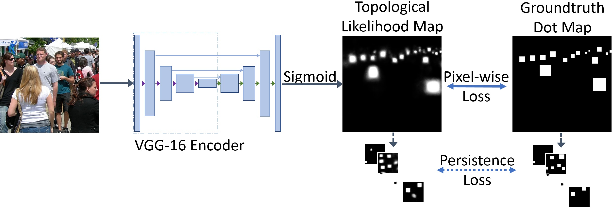

# TopoCount (Localization in the Crowd with Topological Constraints) #

[**Shahira Abousamra, Minh Hoai, Dimitris Samaras, Chao Chen, Localization in the Crowd with Topological Constraints, AAAI 2021.**](https://arxiv.org/pdf/2012.12482.pdf)

TopoCount addresses the problem of crowd localization. Due to various challenges, a localization method is prone to spatial semantic errors, i.e., predicting multiple dots within a same person or collapsing multiple dots in a cluttered region. We propose a topological approach targeting these semantic errors. We introduce a topological constraint that teaches the model to reason about the spatial arrangement of dots. Topological reasoning improves the quality of the localization algorithm. 
We define a persistence loss based on the theory of persistent homology. The loss compares the topographic landscape of the likelihood map and the topology of the ground truth. 

Our method, TopoCount, achieves SOTA localization performance on multiple public benchmarks: ShanghaiTech, UCF QNRF, JHU++, and NWPU. It also has the potential to improve the performance in the crowd counting task.  

 

 

 

### 1. Requirements ###
This implementation requires the following libraries. It was tested with the specified library versions:
 
Python 3.6.5  
PyTorch 0.5.0a0  
Numpy 1.15.1  
Scipy 1.1.0  
scikit-image 0.15.0  
Pillow 6.1.0  
OpenCV 4.1.0  
tqdm 4.25.0  
Matplotlib 2.2.3 

### 2. Pretrained Models ###
TopoCount pretrained models are available on [Google Drive](https://drive.google.com/drive/folders/1qhg3ITOY_qEaNLDfgCP-LOE0Xj1ZH0P7?usp=sharing)  

  
The folder contains the models trained with the following datasets:
ShanghaiTech Part A, ShanghaiTech Part B, UCF QNRF, JHU++, and NWPU-Crowd. 

### 3. Datasets Download ###
Download the datasets and place them unzipped in the folder *datasets*.

There are sample files for ShanghaiTech Part B dataset for a test run of the code.

### 4. Datasets Preprocessing ###
a) In the folder *1\_data_prepare*, there are pre-processing code files for each dataset. 
Go to the directory corresponding to the dataset you are working with.

b) Fix the data paths in the files prefixed with "*1a*" and "*1b*".

c) For training and test, run the files:  
&nbsp;&nbsp;&nbsp;&nbsp;"*1a\_generate\_gt\_custom\_dots.py*" or "*1a\_generate\_gt\_custom\_dots\_boxes.py*"    
&nbsp;&nbsp;&nbsp;&nbsp;"*1b\_generate\_gt\_dotmap.py*"

&nbsp;&nbsp;&nbsp;&nbsp;For test only, run the file:  
&nbsp;&nbsp;&nbsp;&nbsp;"*1b\_generate\_gt\_dotmap.py*"
 

### 5. Training, Testing, and Evaluation ###
The codes for training, testing, and evaluation are in the root directory. There are default values for various configurations including data and output paths specified in the python files. Before running, make sure to fix the configurations as approporiate.  
The training outputs are by default saved in a folder in the " *checkpoints* " directory.
The test and evaluation outputs are by default saved in a folder in the " *eval* " directory.

**Training:**  
Run the file "*2\_train.py*"   
&nbsp;&nbsp;&nbsp;&nbsp;The output and trained models are by default saved in a folder in the " *checkpoints* " directory.

**Testing:**  
a) Run the file "*3\_test\_mae\_rmse\_epochs\_range.py*"   
&nbsp;&nbsp;&nbsp;&nbsp; Evaluates the MAE and RMSE for a range of trained epochs without saving the predictions.  

b) Run the file "*4a\_eval_mae\_rmse\_and\_save\_predictions.py*":  
&nbsp;&nbsp;&nbsp;&nbsp; Evaluates the MAE and RMSE for a specific model and save the predictions for further processing.  

**Evaluation:**  
a) "*4a\_eval\_mae\_rmse\_and\_save\_predictions.py*":  
&nbsp;&nbsp;&nbsp;&nbsp; Evaluates the MAE and RMSE for a specific model and save the predictions for further processing.  

b) "*4b\_eval\_cl-fscore\_from\_saved\_predictions.py*":  
&nbsp;&nbsp;&nbsp;&nbsp; Evaluates the localization F-score by computing the F-score with distance thresholds in the range [1, 100]. The final output is the mean of all the F-scores. This is the localization evaluation metric proposed in the paper:  
*H. Idrees et al., Composition Loss for Counting, Density Map Estimation and Localization in Dense Crowds, ECCV 2018.*  
&nbsp;&nbsp;&nbsp;&nbsp; It uses prediction files already generated and saved by "*4a\_eval\_mae\_rmse\_and\_save\_predictions.py*"    

c) "*4c\_eval\_raz-fscore\_from\_saved\_predictions.py*":  
&nbsp;&nbsp;&nbsp;&nbsp; Evaluates the localization average precision and average recall using the method proposed in the paper:  
*C. Liu et al., Recurrent Attentive Zooming for Joint Crowd Counting and Precise Localization, CVPR 2019.*  
&nbsp;&nbsp;&nbsp;&nbsp; It takes 2 input arguments. sigma and threshold. Check the source file for more details about possible values.   
&nbsp;&nbsp;&nbsp;&nbsp; It uses prediction files already generated and saved by "*4a\_eval\_mae\_rmse\_and\_save\_predictions.py*"    

d) "*4d\_eval\_game_from\_saved\_predictions.py*":  
&nbsp;&nbsp;&nbsp;&nbsp; Evaluates the Grid Average Mean absolute Errors (GAME) localization evaluation metric as proposed in the paper:  
*R. Guerrero-Gomez-Olmedo et al., Extremely Overlapping Vehicle Counting, In Pattern Recognition and Image Analysis 2015.*  
&nbsp;&nbsp;&nbsp;&nbsp; It uses prediction files already generated and saved by "*4a\_eval\_mae\_rmse\_and\_save\_predictions.py*"    

### Citation ###
    @inproceedings{abousamra2021TopoCount,
    author      =  {Shahira Abousamra and Minh Hoai and Dimitris Samaras and Chao Chen},
    title       =  {Localization in the Crowd with Topological  Constraints},
    booktitle   =  {AAAI Conference on Artificial Intelligence (AAAI)},
    year        =  {2021}}

  

 

